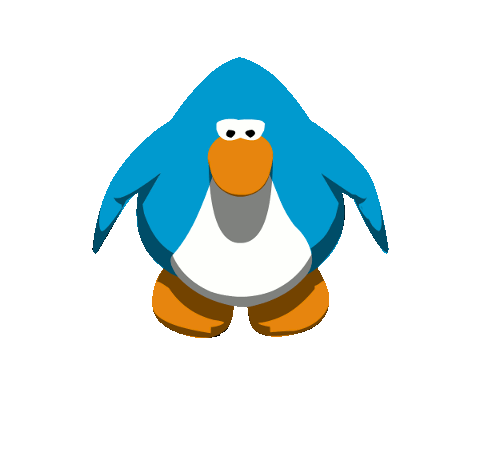

<h1>Obrigado por Vim!!!❤️❤️</h1>

    

<h2>Seja Bem Vindo ou Bem Vinda ao meu GitHub!!!🗿🍷</h2>
<ul>
  <li>
Sou um Programdor Iniciante
</li>
  <li>
Estou Estudando sobre Desenvolvimento Web
</li>
</ul>  

  &nbsp;
  &nbsp;
  &nbsp;

